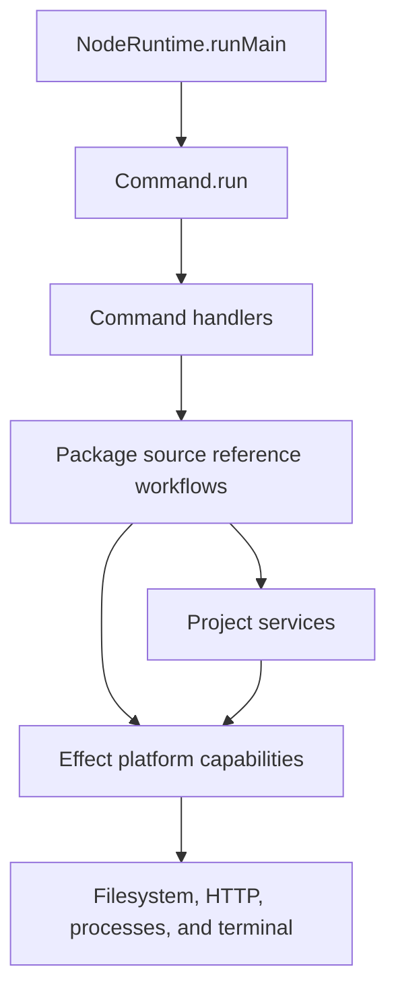

# Use Effect for application workflows and boundaries

Packref uses `Effect<A, E, R>` as the application-work model because its CLI workflows coordinate
filesystem, network, process, and terminal operations that must expose expected failures and remain
replaceable in tests. Pure transformations can remain plain TypeScript, but fallible workflows and
external operations return Effect values, expected failures use typed errors, replaceable adapters use
services, and layers provide implementations at the application or test boundary.

We chose this model over direct `async` functions with thrown exceptions and manually passed adapters.
Direct promises would reduce framework-specific code, but they would make failure sets and required
capabilities implicit across the multi-step operations that resolve a package identity, obtain a source
snapshot, materialize a package source reference, and update the Packref lockfile.

## Effect map

| Boundary              | Effect role                                                                                                                                                                    |
| --------------------- | ------------------------------------------------------------------------------------------------------------------------------------------------------------------------------ |
| Runtime               | `src/index.ts` composes the application layer, provides it once, handles remaining expected failures, and runs the Effect program.                                             |
| Commands              | Parse input, invoke package source reference workflows, report progress and results, and recover from user cancellation.                                                       |
| Workflows             | Coordinate registry and manifest resolution, source snapshot acquisition, materialization, Packref lockfile changes, cleanup, and pruning.                                     |
| Project services      | `Prompter`, `ProjectDependencyReader`, `PackageManagerResolver`, `NpmRegistryClient`, `RemoteTagReader`, `RepositoryDownloader`, and `Reflinker` isolate replaceable behavior. |
| Contextual values     | `PackrefHome` supplies the default Packref home path and permits a test-specific path.                                                                                         |
| Platform capabilities | Effect Node layers provide filesystem, path, HTTP, child-process, terminal, console, and runtime capabilities.                                                                 |
| External libraries    | Promise-based or synchronous APIs remain behind Effect constructors or project services so thrown failures become typed failures.                                              |
| Tests                 | Test layers replace external adapters and contextual values while preserving the production workflow and failure model.                                                        |

Expected failures are recovered at the narrowest boundary that owns the policy. Commands handle user
cancellation, workflows handle bounded fallback and partial-operation aggregation, and the runtime
boundary reports all remaining expected failures and selects the process exit code. Defects remain
distinct from expected failures.

## Consequences

Application function types expose their success values, expected failures, and required services. Tests
can replace individual adapters without changing package source reference workflows, and production
composition stays visible in one application layer. In return, contributors must understand Effect's
type and layer model, adapter code must wrap non-Effect APIs, and upgrades can require architecture-level
changes while Packref depends on a beta Effect release.
